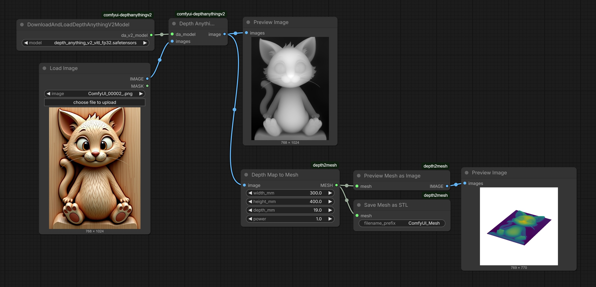

# ComfyUI depth2mesh

A set of custom nodes for **[ComfyUI](https://github.com/comfyanonymous/ComfyUI)** that allows you to convert **Depth Map** images into **3D STL Meshes** directly within your workflow.

These nodes are particularly useful for:
*   **CNC Milling / CAM**: Generating height-mapped reliefs from AI-generated images.
*   **3D Printing**: Creating weak-relief lithophanes or textured surfaces.
*   **3D Assets**: Rapid prototyping of terrain or embossed textures.

---

## Features

*   **Depth Map to Mesh**: Converts an image-based depth map (grayscale) into a closed, watertight 3D mesh.
*   **Physical Dimensions**: Define precise output size in millimeters (Width, Height, Max Depth).
*   **Mesh Simplification**: Reduce face count on dense meshes for easier handling in slicers or CAM software.
*   **3D Preview**: View a lightning-fast isometric render of your mesh directly in ComfyUI.
*   **Save as STL**: Export watertight `.stl` files ready for manufacturing.
*   **Alpha Masking**: Uses the image alpha channel to define the active shape (pixels with alpha=0 are ignored).

---

## Example Workflow



`Load Image` -> `Depth Map to Mesh` -> `Simplify Mesh` -> `Preview Mesh as Image` -> `Preview Image`
                                           |
                                           +-> `Save Mesh as STL`

---

## Installation

### Method 1: ComfyUI Manager (Recommended)
1.  Install [ComfyUI Manager](https://github.com/ltdrdata/ComfyUI-Manager).
2.  Search for **depth2mesh** in the "Install Custom Nodes" list.
3.  Click Install and Restart ComfyUI.

### Method 2: Manual Installation
Clone this repository into your `ComfyUI/custom_nodes/` directory and install dependencies.

```bash
cd ComfyUI/custom_nodes/
git clone https://github.com/your-username/depth2mesh.git
cd depth2mesh

# Install requirements
pip install -r requirements.txt
```

*Note: For Windows users, if you encounter issues installing `open3d` or `fast-simplification`, ensure you have the latest Visual C++ Redistributables.*

---

## Nodes Overview

### 1. Depth Map to Mesh
The core node that performs the conversion.

*   **Inputs**:
    *   `image`: The source depth map (IMAGE). Brighter pixels = higher geometry. Alpha channel cuts the mesh.
    *   `width_mm`: Physical X-axis width of the output model.
    *   `height_mm`: Physical Y-axis height of the output model.
    *   `depth_mm`: Maximum Z-axis height (thickness) of the relief.
    *   `power`: Curve response. `1.0` is linear. `>1.0` makes peaks sharper, `<1.0` makes gradients flatter.
*   **Outputs**:
    *   `MESH`: A Trimesh geometry object passed to other nodes.

### 2. Simplify Mesh
Reduces the polygon count of the generated mesh. This is crucial as raw pixel-to-mesh conversion can produce millions of triangles (one pair per pixel).

*   **Inputs**:
    *   `mesh`: Input Mesh.
    *   `target_face_count`: Desired maximum number of faces (e.g., 100,000).
*   **Outputs**:
    *   `MESH`: The decimated mesh.

*Note: This node attempts to use `fast-simplification` for speed, falling back to standard `trimesh` methods if unavailable.*

### 3. Preview Mesh as Image
Generates a static 3D isometric image of the mesh to verify geometry without leaving ComfyUI.

*   **Inputs**:
    *   `mesh`: Input Mesh.
*   **Outputs**:
    *   `IMAGE`: A rendered view of the mesh (can be connected to a generic `Preview Image` node).

### 4. Save Mesh as STL
Saves the mesh to your ComfyUI output directory.

*   **Inputs**:
    *   `mesh`: Input Mesh to save.
    *   `filename_prefix`: Filename pattern (e.g., `MyRelief_`). Automatically increments counters (e.g., `MyRelief_00001.stl`).

---

## Standalone Python Usage

You can also use the core logic as a standard Python library for batch processing scripts outside of ComfyUI.

```python
from PIL import Image
from depth2mesh.core import depth2mesh

# Load image
img = Image.open("depthmap.png")

# Generate Mesh
# width=100mm, height=100mm, max_depth=10mm
mesh = depth2mesh(img, 100.0, 100.0, 10.0)

# Export
mesh.export("output.stl")
```

## Requirements

*   **Python 3.10+**
*   **trimesh**: Handing geometry.
*   **numpy**: Matrix operations.
*   **Pillow**: Image processing.
*   **matplotlib**: Generating previews.
*   **fast-simplification**: (Optional) High-performance mesh decimation.

## License

MIT License.